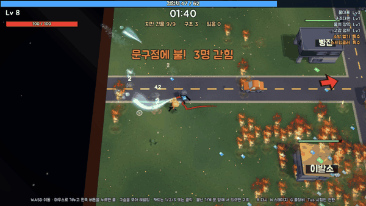

# 소방관 출동! — 동네를 지키는 소방 뱀서라이크



4분 동안 작은 동네를 지킨다. 불 괴물이 사방에서 몰려오고, 가게에 불이 나고, 사람이 갇힌다.
호스를 직접 겨눠 불을 끄고, 문 앞에 서서 사람을 구하고, 레벨업 카드로 장비를 모아 3:00에 시작되는 대화재를 버틴다.

Unity 6 시험판이다. 규칙은 Unity 없이 도는 순수 C#이라 `dotnet test`로 봇이 수백 판을 돌려 밸런스를 잰다.

```
불 괴물을 끈다 → 경험치 구슬 → 레벨업 카드 3택1 → 더 센 장비
      ↑                                              ↓
 가게에 불(신고) ← 불씨가 건물로 번진다 ← 끄지 않으면 무너진다
      ↓
 문 앞에 서서 갇힌 사람 구조 → 다 구하면 보물상자
```

---

## 한 판 (4분)

규칙은 `unity/Assets/Scripts/Prototypes/Logic/SurvivorSim.cs`, 스테이지별 수치는 `SurvivorStage.cs`에 있다.

| 시각 | 사건 |
|---|---|
| 0:10~ | **신고**: 아직 안 탄 가게 하나에 불이 난다 |
| 1:00 · 2:00 · 3:00 | 불 괴물이 사방에서 에워싸는 **웨이브** (15 · 20 · 25마리) |
| 1:20 · 2:40 | **대형 신고**: 안 탄 가게에 큰 불이 나고 3명이 더 갇힌다. 한 명도 잃지 않고 다 구하면 문 앞에 보물상자 |
| 3:00~4:00 | **대화재**: 랜드마크(물류창고·제재소)가 통째로 타고 5명이 갇힌다. 8초마다 신고가 이어지고, 랜드마크는 4초마다 불씨 8개를 뿜는다 |
| 4:00 | 동네를 절반 넘게 지키고 있으면 **승리** |

보스는 없다. 목표는 센 적을 잡는 것이 아니라 건물과 사람을 지키는 것이다.

### 불
- **타는 건물**: 불 세기(0~1)가 점점 커지고, 그만큼 튼튼함이 깎인다. 불 세기 1로 32초 타면 무너진다(나무·차는 20초). 타는 동안 불씨를 뱉고, 세기 0.8이 넘으면 8초마다 가장 가까운 건물로 옮겨붙는다.
- **끄기**: 물을 맞히면 불 세기가 줄고, 0이 되면 꺼진 뒤 8초 동안 젖어 있어 다시 붙지 않는다. 큰 불일수록 꾸준한 물이 덜 먹힌다(세기 1이면 45%).
- **증기 폭발**: 건물 불에 물대포 물을 2초 분량 맞히면(잠깐 손을 떼도 천천히 식을 뿐 남는다) 김이 터지며 불 세기가 한 번에 0.35 줄고, 곁의 불 몹을 데우고 밀어낸다. 큰 불은 이렇게 뚫는다.
- **밀치기**: 물줄기는 노즐 가까이의 불 떼를 밀어낸다. 큰 불·기름 방울은 절반만 밀린다.
- **연속 진압 콤보**: 처치(+1)와 건물 진화(+5)가 1초 안에 이어지면 콤보가 쌓인다. 20마다 구슬이 2배가 된다.
- **열기**: 타는 건물 가장자리 2.5칸(타는 나무 1.5칸) 안에 있으면 초당 `5 × 불 세기`만큼 체력이 깎인다. 먼저 끄고 들어갈지, 바로 들어가 구할지 골라야 한다.
- **가스통**: 불이 붙으면 2.5초 뒤 터진다. 반경 3.5칸의 건물 불을 키우고 불씨를 흩뿌린다. 미리 적셔 두면 붙지 않는다.
- **가장자리 스폰**: 초당 1.5마리(마을 2마리)에서 4:00 무렵 8마리(마을 10마리)까지 늘어난다. 동시에 있는 적은 350마리를 넘지 않는다.

| 적 | 체력 | 속도 | 특징 |
|---|---|---|---|
| 불씨 | 2 | 2.4 | 9칸 안의 탈 것으로 가서 불을 옮긴다. 없으면 소방관을 쫓는다 |
| 큰 불 | 14 | 1.5 | 지나간 자리에 타는 바닥을 남긴다 |
| 다트 | 2 | 4.2 | 빠르게 돌진한다 (마을, 1:00부터) |
| 불다람쥐 | 3 | 3.6 | 나무로 달려가 불을 붙이고 사라진다 (숲) |
| 재 박쥐 | 1.5 | 3.2 | 0:30부터 20초마다 무리 지어 날아온다 (숲) |

### 구조
- 가게에 불이 나면 안의 주민이 갇힌다. 문 앞 1.3칸 안에 **1.2초 서 있으면** 한 명을 구한다(체력 +5).
- 불 세기가 0.6 이상인 큰 불 속에서는 연기 때문에 15초마다 한 명씩 잃는다. 건물이 무너지면 남은 사람을 모두 잃는다.
- **곧 무너진다**: 사람이 갇힌 건물이 12초 안에 무너질 참이면 지붕 라벨이 "무너진다 N초"로 바뀌고 알림이 뜬다(건물마다 한 번, 끄면 다시).
- **아슬아슬 구조**: 무너지기 6초 전에 구하면 경험치 +40(기본 20에 더해). 시간이 느려지고 금색 글자가 뜬다.
- **랜드마크 사수**: 대화재 랜드마크에 갇힌 사람을 다 구하면 경험치 +80과 금색 띠. 대화재의 절정이다.
- **보물상자**: 대형 신고에서 한 명도 잃지 않으면(다 구하거나 불을 다 끄면) 나온다. 30초 안에 주우면 카드를 2번 고르고, 첫 번째에는 노란 카드가 반드시 나온다.
- **공구상자**: 부서진 건물이 있으면 40초마다 하나 떨어진다(20초 뒤 사라짐). 주우면 가장 약한 건물의 튼튼함을 절반만큼 되찾는다. 고칠 건물이 없으면 체력 +20.

### 승패와 별
- **진다**: 체력이 0이 되거나, 건물이 절반 넘게 무너진다(마을 9채 중 5채, 숲 8채 중 5채).
- **이긴다**: 4:00까지 버틴다. 별은 기본 ★1에 더해
  - 지킨 건물 75% 이상이면 ★
  - 잃은 사람이 0명이면 ★

---

## 스테이지

스테이지마다 Lv1 물대포 하나로 새로 시작한다. 소방관은 스테이지로 강해지지 않고, 난이도는 세계 쪽 규칙으로만 올린다. 배치는 시드와 상관없이 늘 같다.

| | 1 마을 (`SurvivorTown.cs`) | 2 산불 숲 (`SurvivorForest.cs`) |
|---|---|---|
| 지킬 건물 | 가게 8채 + 물류창고 | 산장·매점 등 7채 + 제재소 |
| 그 밖에 타는 것 | 가스통 3, 나무 8, 차 5 | 캠핑 가스통 3, 캠핑카 2, 나무 무더기 14곳 |
| 신고 | 15번 (2:00·3:00엔 두 곳) | 12번 |
| 새 위협 | 신고, 가스통 | **바람**: 60초마다 방향이 바뀌고, 타는 나무가 7초마다 바람 쪽 4칸 안 이웃에 30%(대화재 35%) 확률로 불을 옮긴다 |
| 새 불 몹 | 다트 | 불다람쥐, 재 박쥐 |
| 전용 노란 카드 | 소방차 출동, 스프링클러 | 비구름, 방염제 살포 |

스테이지를 어떻게 어렵게 만드는지, 봇으로 무엇을 재는지는 [docs/prototype-c-balance.md](docs/prototype-c-balance.md)에 있다.

---

## 레벨업 카드

카드 규칙은 `Logic/SurvivorUpgrades.cs`에 있다.

- 구슬로 경험치를 모은다. 다음 레벨까지 `6 + 5×Lv + Lv²/4`가 필요하다.
- 레벨이 오르면 게임이 멈추고 카드 3장 중 하나를 고른다.
- 무기 6종 중 4칸, 보조 6종 중 4칸만 들 수 있어 판마다 골라야 한다. 각 항목은 Lv5까지 오른다. 처음에는 물대포 하나만 들고 시작한다.
- 무기마다 **짝 보조**가 있다. 무기가 Lv5이고 짝 보조를 들고 있으면 다음 레벨업에 **진화** 카드가 반드시 나온다.
- 더 고를 게 없으면 "응급 처치"(체력 30 회복)가 나온다.

아이템 하나는 **눈에 보이는 동작 하나**다. 보조도 퍼센트만 올리지 않고 화면에서 뭔가를 한다.

| 무기 | 효과 | 짝 보조 | 효과 | 진화 |
|---|---|---|---|---|
| 물대포 | 겨눈 쪽으로 물줄기를 뿜는다 | 고압 펌프 | 사거리·세기 +15%/Lv. **증기 폭발이 25%/Lv 빨리 차고 0.5칸/Lv 넓어진다**(방수포에도) | **고압 방수포**: 관통하는 물줄기가 사방을 휩쓴다 |
| 구조대원 | 대원이 갇힌 사람에게 달려가 불을 끄며 구한다 (Lv3 2명, Lv5 3명) | 장화 | 이동 +12%/Lv. **불 바닥을 밟아도 안 다치고 밟은 자리를 끈다**(젖은 발자국) | **구조 분대**: 대원 4명이 여러 건물을 동시에 구한다 |
| 물폭탄 | 불난 건물(없으면 불 떼)에 물폭탄을 던진다 | 무전기 | 다음 신고를 2초(+1/Lv) 먼저 알려 준다. **그 건물 6칸 안에 미리 가 있으면 선제 출동**: 불이 0.15로 작게 붙고 구슬 10 | **공중 소화탄**: 맵 어디든 불난 건물마다 떨어진다 |
| 순찰 드론 | 가장 센 불난 건물로 날아가 **드론마다 2.5초에 한 번 물폭탄을 투하**한다(저항 무시 0.25) | 구조 도끼 | **문을 부수고 한 번에 2명**(Lv3 3명, Lv5 4명)을 데리고 나온다 | **구조 드론**: 드론이 갇힌 사람을 끌어올려 구한다 |
| 물의 장막 | 몇 초마다 몸 주위로 물 고리가 터져 불을 밀어낸다 | 방화복 | 불 피해 −15%/Lv, 최대 체력 +10/Lv. **닿은 불 몹이 튕겨 나간다** | **물의 방벽**: 커다란 물 고리가 건물 불을 크게 줄인다 |
| 방수 포탑 | 7초마다 선 자리에 포탑을 세워 곁 불을 쏜다 | 산소통 | **6초(−0.5/Lv)마다 가까운 갇힌 건물에 산소통을 던져** 연기 시계를 되돌린다 | **현장 구조소**: 포탑 곁 건물에선 연기로 사람을 잃지 않는다 |

진화 카드가 떠도 노란 카드는 함께 나온다(상자 첫 장·5의 배수 레벨).

### 노란 카드 (특수 장비)
레벨 1짜리이고 무기·보조 칸을 쓰지 않는다. **Lv5·10·15…로 오를 때는 반드시 한 장** 나오고, 그 밖의 레벨업에서는 15% 확률로 섞인다. 스테이지마다 4장이 나온다.

| 카드 | 나오는 곳 | 효과 |
|---|---|---|
| 소방 헬기 | 공통 | 9초마다 헬기가 가장 큰 불에 물을 쏟는다 |
| 구급차 | 공통 | 20초마다 연기가 가장 짙은 건물의 연기를 걷어 낸다. 구할 때 체력 +10 |
| 소방차 출동 | 마을 | 12초마다 소방차가 가장 센 불난 건물 줄을 달리며 양옆 불을 쓸어낸다 |
| 스프링클러 | 마을·공단 | 6초마다 모든 건물 지붕에서 물이 터져 불을 줄인다 |
| 비구름 | 숲 | 12초마다 불이 몰린 곳에 먹구름이 3초 동안 비를 뿌린다 |
| 방염제 살포 | 숲 | 15초마다 비행기가 방염제 띠를 뿌린다. 띠 안은 20초 동안 불이 안 붙는다 |
| 폼 살포 | 공단 | 10초마다 바닥 불이 몰린 곳에 소화 폼을 깐다. 기름 불을 덮고 8초 동안 막는다 |

---

## 소방서

판 사이에 남는 것. 규칙은 `Logic/FireStation.cs`, 저장은 PlayerPrefs `firegame.proto.station` 한 줄이다.

- 판을 이기면 받은 별(★1~3)이 **통장**에 쌓이고, 스테이지별 최고 별이 남는다.
- 게임을 켜면, 그리고 결과창을 탭하면 소방서가 열린다. 소방관을 골라 **출동**하면 판이 시작된다.
- 소방관은 모두 물대포를 들되 **시작 장비**가 다르다. 별로 해금한다(한 번 해금하면 계속 쓴다).

| 소방관 | 시작 장비 | 해금 |
|---|---|---|
| 신입 소방관 | 물대포 | 처음부터 |
| 구조반장 | 물대포 + 구조대원 | ★3 |
| 드론 담당 | 물대포 + 순찰 드론 | ★5 |
| 펌프 기사 | 물대포 + 고압 펌프 | ★5 |
| 베테랑 | 물대포 + 물의 장막 + 방화복 | ★8 |

`RosterReport`(봇 10판)로 소방관마다 할 만한지 잰다: 마을 승 4~6/10, 신입보다 지나치게 잘 이기는 소방관은 없다.

---

## 조작

| | 폰 (두 엄지) | PC (에디터) |
|---|---|---|
| 이동 | 화면 왼쪽 반 아무 데나 누르고 끌기 | WASD / 방향키 |
| 물 뿜기 | 화면 오른쪽 반을 누르고 있는 동안 쏜다. 끈 쪽으로 겨눈다 | 마우스로 겨누고 왼쪽 버튼을 누르고 있기 |
| 카드 고르기 | 탭 | 1 · 2 · 3 또는 클릭 |
| 출동 (소방서에서) | 출동 버튼 탭 | Enter · Space 또는 클릭 |
| 다시 하기 | 결과창 탭 → 소방서 | R |
| 풀장비 ↔ 일반 | — | G |
| 다음 스테이지 | — | N |

폰 스틱은 누른 자리가 중심이 되는 떠 있는 조이스틱이다(`Logic/TwinStick.cs`). 물 스틱을 끌지 않고 누르기만 하면 걷는 방향으로 쏜다.

---

## 화면

- Unity 6 + URP 17.3. 땅을 65도로 내려다보는 원근 카메라, 해와 부드러운 그림자, 블룸.
- 가게·창고·차·소방차·나무·덤불·바위는 CC0 3D 모델이다(Kenney). `tools/fetch-models.sh`가 받아 `unity/Assets/Resources/Models/`에 두고, 받은 파일은 저장소에 들어 있어 다시 받을 필요는 없다.
- 그림·모델·글꼴·소리 출처는 [CREDITS.md](CREDITS.md).

---

## 폴더 구조

```
unity/Assets/Scripts/Prototypes/   시험판 A·B·C (지금 게임은 C)
  Logic/                           규칙(순수 C#, UnityEngine 의존성 0)
                                   SurvivorSim · SurvivorStage · SurvivorTown · SurvivorForest
                                   SurvivorUpgrades · SurvivorBot · TwinStick · AimAssist · WaterRibbon …
  SurvivorView.cs                  화면·연출·소리
  Models3D.cs · GroundArt.cs       3D 모델 세우기, 바닥 그림
  ShopArt.cs · PixelPeople.cs      가게 간판·사람 그림
  Editor/                          메뉴(FireGame ▸ 시험판 …), 캡처, 폰 빌드, 모델 가져오기, URP 설정
unity/Assets/Resources/Models/     CC0 3D 모델 (Houses · Cars · Nature · People)
proto-tests/                       규칙 테스트(xunit). Logic/*.cs를 링크해 Unity 없이 돈다
core/                              옛 캠페인 규칙 + 공용 타입(Rng·Vec2). proto-tests가 참조한다
docs/                              밸런스 정책과 봇 측정 기록
tools/                             unity-check.sh · ios-install.sh · fetch-models.sh · 에셋 임포트
```

규칙이 Unity 밖에서도 돌아서, 불 번짐·무기 위력·스폰 곡선 같은 숫자를 Unity를 켜지 않고 `dotnet test`로 고치고 확인한다. 봇(`SurvivorBot`)이 조준·이동·구조·카드 고르기까지 실제 플레이 경로를 탄다.

---

## 실행

### 1. 규칙 테스트 (Unity 불필요)
```bash
brew install dotnet
dotnet test proto-tests
```

### 2. Unity 에디터에서
**준비** (한 번만)
1. `brew install --cask unity-hub`
2. Hub에서 Unity 계정 로그인 → **Personal(무료) 라이선스** 발급
3. 에디터 **6000.3.24f1** 설치 (`unity/ProjectSettings/ProjectVersion.txt`에 고정):
   ```bash
   "/Applications/Unity Hub.app/Contents/MacOS/Unity Hub" -- --headless \
     install --version 6000.3.24f1 --module ios --childModules
   ```
   `--childModules`를 빼면 하위 모듈 설치 여부를 묻는 질문에서 멈춘다. 폰 빌드를 안 할 거면 `--module` 이후는 생략해도 된다.
4. 에디터를 처음 켜면 **Unity 이용약관 동의 창**이 뜬다. 다른 창 뒤에 가려져 멈춘 것처럼 보일 수 있다.

**실행**
```bash
./sync-core.sh
open -a /Applications/Unity/Hub/Editor/6000.3.24f1/Unity.app --args -projectPath "$PWD/unity"
```
메뉴 **FireGame ▸ 시험판 C (뱀서)** 를 고르면 바로 Play 모드로 들어간다. **시험판 C (풀장비)** 는 모든 카드를 최대로 들고 시작한다(연출 확인용).

`core/`를 고쳤다면 `./sync-core.sh`를 다시 실행한다(`unity/Assets/Scripts/Core/`는 사본이라 직접 고치지 않는다).

### 3. 아이폰
```bash
tools/ios-install.sh              # Unity 빌드 → Xcode 서명·빌드 → 설치 → 실행
tools/ios-install.sh --no-unity   # Unity 빌드는 건너뛰고 이미 있는 Xcode 프로젝트로 설치만
```
필요한 것: Unity iOS 모듈, Xcode에 로그인한 개발자 팀, 개발자 모드를 켜고 잠금을 푼 아이폰(USB 또는 같은 와이파이).
폰 빌드에서는 시험판 C가 바로 뜬다. 빌드는 iOS 전용 복사본(`tools/.unity-ios`)에서 돌아서 에디터를 닫을 필요가 없다.

### 4. 검증 도구
```bash
tools/unity-check.sh compile       # 실제 Unity 컴파일. 오류가 있으면 실패
tools/unity-check.sh proto-shots   # 시험판 화면을 tools/.shots-proto/ 에 PNG로 캡처
tools/unity-check.sh models        # Resources/Models 모델마다 머티리얼·셰이더·클립·크기를 찍는다
tools/unity-check.sh urp-setup     # URP 파이프라인 애셋을 만들고 그래픽·품질 설정에 꽂는다
tools/unity-check.sh ios           # 아이폰용 Xcode 프로젝트만 만든다(unity/Builds/ios)
tools/fetch-models.sh              # CC0 3D 모델을 다시 받는다(같은 파일을 덮어쓴다)
```

---

## 밸런스 기준

봇 테스트(`proto-tests/`)가 보증하는 것:

- 가만히 서 있으면 150초 안에 진다.
- 봇이 시드 10개 중 절반 이상 대화재까지 가고(30판 기준 60%), 3~9개를 이긴다(해볼 만하지만 늘 이기지는 않는다).
- 뒤 스테이지가 앞 스테이지보다 어렵다(더 많이 지거나 건물을 더 많이 잃는다).
- 뒤 스테이지도 1스테이지만큼 할 일이 온다: 레벨업 간격 1.2배 이내, 걷기만 하는 시간 +5%p 이내, 분당 사건 0.8배 이상.
- 체력이 절반 밑으로 떨어지는 위기 판이 10판 중 3~8판이다.
- 어떤 아이템도 쓰레기템(구한 사람이 평균의 65% 미만)이나 필수템(승이 평균의 2배 초과)이 아니다.
- 동시에 있는 적은 350을 넘지 않고, 4분 한 판을 시뮬레이션해도 3초 안에 끝난다.
- 같은 시드면 같은 판이다.

측정 표와 조정 경과는 [docs/prototype-c-balance.md](docs/prototype-c-balance.md). `FIREGAME_SEEDS=30 dotnet test proto-tests --filter FunReport`처럼 판 수를 늘려 편차를 줄일 수 있다.

## 아직 모르는 것 · 알려진 한계

- **사람이 폰으로 할 때의 난이도**: 봇은 조준이 완벽하다. 두 엄지로 하는 사람의 승률은 해 봐야 안다.
- **봇은 증기 폭발을 못 쓴다**: 봇은 코앞의 불 몹을 먼저 쏴서 건물에 물을 거의 안 뿌린다. 증기 폭발·콤보의 손맛은 사람이 폰으로 판단한다(docs §10).
- **공단이 마을만큼 쉽다**: 봇 30판 기준 마을 12승, 숲 5승, 공단 12승(2026-10-02 측정). 공단 쪽 규칙으로 올릴 일이 남았다.
- **소방서는 얕다**: 소방관 5명과 별 통장뿐이다. 스테이지는 셋이고, 공단을 깨면 마을로 돌아간다.

---

## 지난 방향 (참고)

- **캠페인** (`core/`, 메뉴 **FireGame ▸ 본 게임**): 섬마을 지도에서 신고를 받고, 장비를 레벨업해 현장 6곳을 진압하는 게임. 생각 없이 짠 봇이 캠페인 전체를 깨서 고민할 거리가 없었다. 자세한 설명은 커밋 `607b5eb`의 README에 남아 있다.
- **시험판 A** (실시간 물줄기)와 **시험판 B** (턴제 퍼즐): 둘 다 재미 검증에 실패했다. 메뉴에서 여전히 띄울 수 있다.
- **화염 거인**: 시험판 C의 4:00 보스였다. 체력 큰 적을 쏘는 절정이 "건물과 사람을 지킨다"는 목표와 어긋나 대형 신고와 대화재로 바꿨다.
